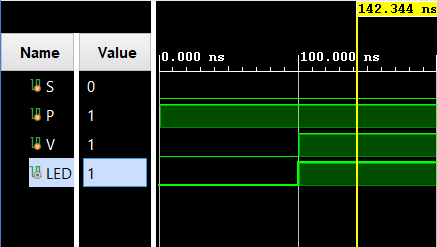
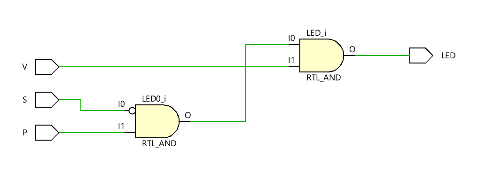
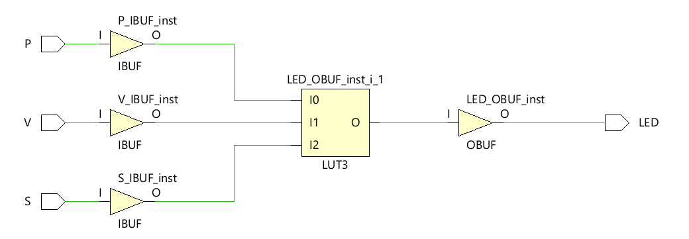

# Combinational Circuit Design in Verilog

This directory contains the implementation of a combinational circuit designed to control an LED based on the inputs `S`, `P`, and `V`. Two methods of design are provided, along with a test bench to verify their functionality.

## Files Included

- `method_1.v`: The first implementation of the combinational circuit using direct dataflow modeling.
- `method_2.v`: The second implementation of the combinational circuit using a combination of NAND and NOR gates.
- `testbench.v`: The test bench for the combinational circuit, which verifies its functionality through various input combinations.
- `question.md`: A document containing the problem statement and requirements for the combinational circuit design.

## Functionality

The combinational circuit takes three inputs:
- `S`: Control signal.
- `P`: Control signal.
- `V`: Control signal.

It produces one output:
- `LED`: The output that indicates whether the LED should glow based on the input conditions.

### Method 1
In `method_1.v`, the LED glows if:
- `S` is low (0)
- `P` is high (1)
- `V` is high (1)

The output logic is represented as:
```LED = (~S) & (P) & (V);```


## Test Bench

The test bench (`testbench.v`) verifies the combinational circuit by simulating different input combinations and observing the resulting output (`LED`).

## How to Simulate

### Using Icarus Verilog:
1. Compile the Verilog files using Icarus Verilog:
   ```bash
   iverilog -o circuit_sim method_1.v method_2.v testbench.v
   ```
2. Run the simulation:
   ```bash
   vvp circuit_sim
   ```

3. This will generate a `dump.vcd` file, which contains the waveform data for the simulation.

### Viewing the Waveform in GTKWave:
1. Open GTKWave:
   ```bash
   gtkwave dump.vcd
   ```

2. Add the signal `LED` to the waveform viewer to observe how the output changes based on the inputs.

### GTKWave Code Snippet:

```bash
# To view the simulation results:
gtkwave dump.vcd
```

## Screenshots

### Simulation
Simulation results will show the output `LED` changing based on the input values of `S`, `P`, and `V`.




### RTL Analysis
The RTL schematic will display the combinational circuit based on the selected method.



### Synthesis



## License

This project is licensed under the MIT License.
