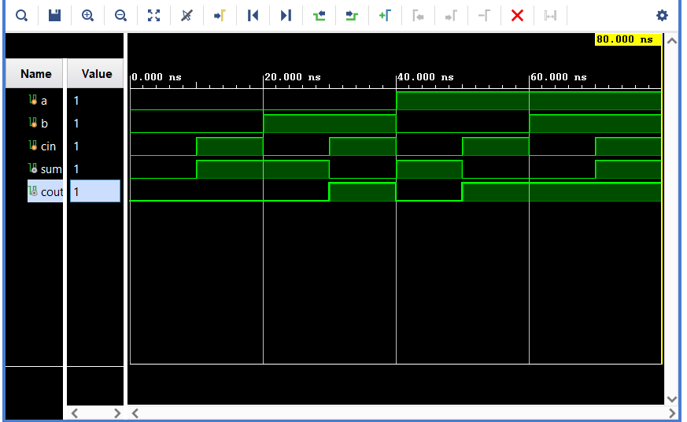
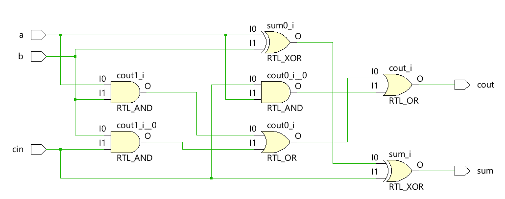
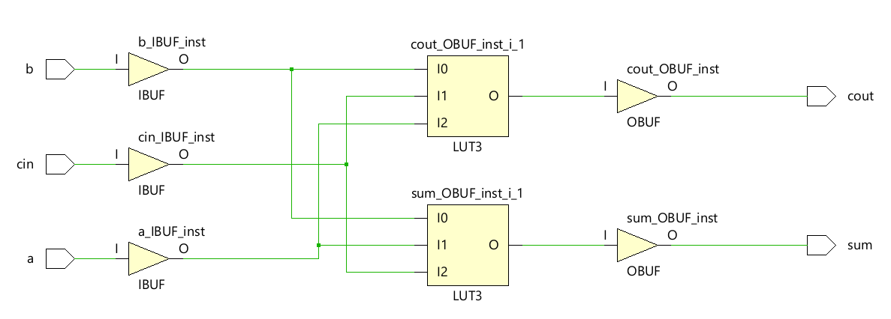

# Full Adder Design

This directory contains the implementation of a Full Adder circuit in Verilog, along with its test bench and an optimized version of the design. The Full Adder is a fundamental building block in digital circuits, used for binary addition.

## Files Included

- **full_adder.v**: The Verilog implementation of the Full Adder.
- **full_adder_optimized.v**: An optimized version of the Full Adder design, focusing on minimizing area and power.
- **tb_full_adder.v**: The test bench for the Full Adder, verifying its functionality through various input combinations.
- **testbench.c**: The C implementation of the Full Adder test bench, simulating the same functionality as `tb_full_adder.v`.
- **full_adder_netlist.v**: The netlist generated from the Full Adder design using the OSS CAD Suite (Yosys).

## Functionality

The Full Adder takes three inputs:
- `a`: First input bit
- `b`: Second input bit
- `cin`: Carry input bit

It produces two outputs:
- `sum`: The sum output
- `cout`: The carry output

## Test Bench

The test bench (`tb_full_adder.v`) verifies the Full Adder by simulating all possible input combinations (000 to 111) and printing the resulting sum and carry values.

## C Test Bench

The C test bench (`testbench.c`) implements the Full Adder logic in C, allowing verification of the outputs against the Verilog implementation.

## Optimization

The optimized Full Adder (`full_adder_optimized.v`) is designed to reduce area and power consumption while maintaining the same functionality as the original design.

## Screenshots

### Simulation

### RTL Analysis

### Synthesis

## How to Simulate

1. Open the project in Xilinx Vivado or any Verilog simulator.
2. Compile the `full_adder.v` and `tb_full_adder.v` files.
3. Run the simulation to observe the output.

## License

This project is licensed under the MIT License.
