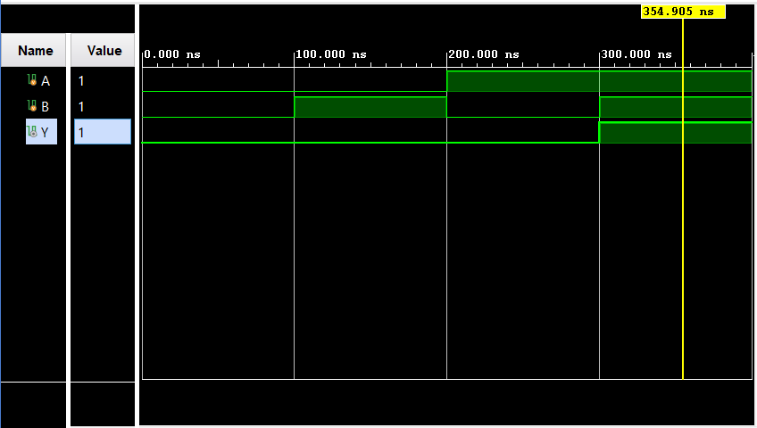
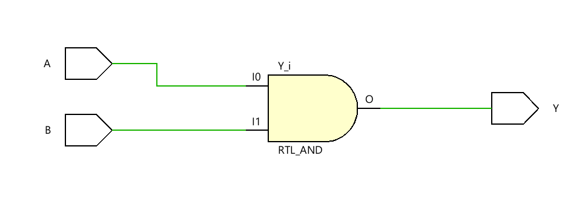

# Gate Design in Verilog

This directory contains the implementation of basic logic gates (AND, OR, NAND, NOR, XOR) in Verilog, along with a test bench to verify their functionality. The default gate implemented is an AND gate, but other gates can be easily activated by uncommenting the respective lines.

## Files Included

- `design.v`: The Verilog implementation of the logic gate (default is AND gate).
- `testbench.v`: The test bench for the logic gate, which verifies its functionality through various input combinations.

## Functionality

The logic gate takes two inputs:
- `A`: First input bit.
- `B`: Second input bit.

It produces one output:
- `Y`: The output of the logic gate, which by default is the result of the AND gate.

### Other Gates (Commented in the Code)
- OR gate
- NAND gate
- NOR gate
- XOR gate

You can activate any of the gates by uncommenting the respective lines in `design.v`.

## Test Bench

The test bench (`testbench.v`) verifies the logic gate by simulating all possible input combinations (`00`, `01`, `10`, `11`) and printing the result of the output (`Y`).

## How to Simulate

### Using Icarus Verilog:
1. Compile the Verilog files using Icarus Verilog:
   ```bash
   iverilog -o gate_sim design.v testbench.v
   ```
2. Run the simulation:
   ```bash
   vvp gate_sim
   ```

3. This will generate a `dump.vcd` file, which contains the waveform data for the simulation.

### Viewing the Waveform in GTKWave:
1. Open GTKWave:
   ```bash
   gtkwave dump.vcd
   ```

2. Add the signals `A`, `B`, and `Y` to the waveform viewer to observe how the output changes based on the inputs.

### GTKWave Code Snippet:

```bash
# To view the simulation results:
gtkwave dump.vcd
```

## Screenshots

### Simulation
Simulation results will show the output `Y` changing based on the input values of `A` and `B`.


### RTL Analysis
The RTL schematic will display the logic gate as a simple two-input gate.


## How to Simulate

1. Open the project in any Verilog simulator such as Icarus Verilog or ModelSim.
2. Compile the `design.v` and `testbench.v` files.
3. Run the simulation to observe the output.
4. View the waveform in GTKWave by opening the `dump.vcd` file.

## License

This project is licensed under the MIT License.
