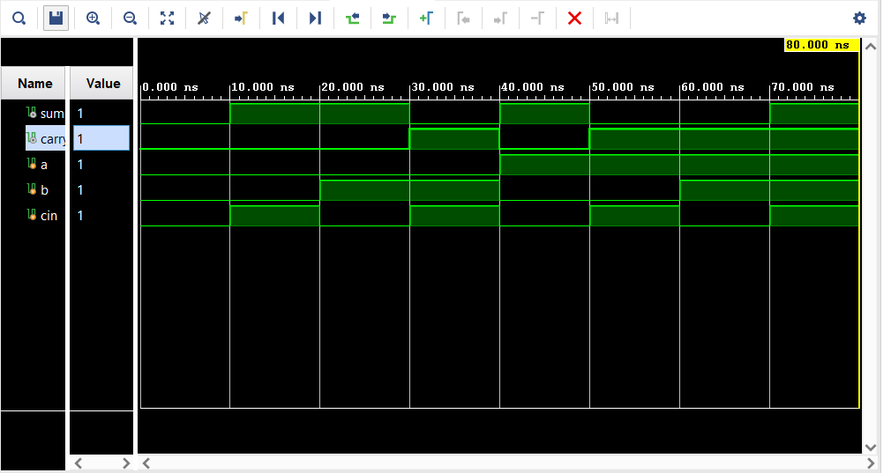
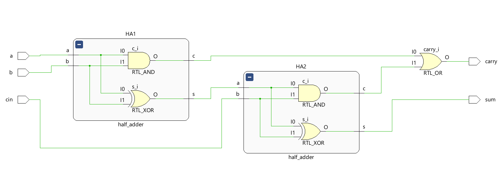
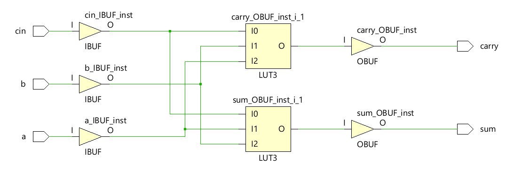

# Full Adder Design (Using Half Adders)

This directory contains the implementation of a Full Adder circuit designed using two Half Adders in Verilog, along with its test bench and an optimized version of the design. The Full Adder is a fundamental building block in digital circuits, used for binary addition.

## Files Included

- **full_adder.v**: The Verilog implementation of the Full Adder using two Half Adders.
- **half_adder.v**: The Verilog implementation of the Half Adder, which is used in the Full Adder design.
- **testbench.c**: The C implementation of the Full Adder test bench, simulating the same functionality as `stimuli.v`.
- **full_adder_netlist.v**: The netlist generated from the Full Adder design using the OSS CAD Suite (Yosys).
- **stimuli.v**: The Verilog test bench for the Full Adder, verifying its functionality through various input combinations.

## Functionality

The Full Adder takes three inputs:
- `a`: First input bit
- `b`: Second input bit
- `cin`: Carry input bit

It produces two outputs:
- `sum`: The sum output
- `carry`: The carry output

The Full Adder is constructed using two Half Adders:
1. The first Half Adder takes inputs `a` and `b`, producing an intermediate sum (`s1`) and carry (`c1`).
2. The second Half Adder takes the intermediate sum (`s1`) and the carry input (`cin`), producing the final sum and an additional carry (`c2`).
3. The final carry output is the logical OR of the two carry outputs (`c1` and `c2`).

## Test Bench

The test bench (`stimuli.v`) verifies the Full Adder by simulating all possible input combinations (000 to 111) and printing the resulting sum and carry values.

## C Test Bench

The C test bench (`testbench.c`) implements the Full Adder logic in C, allowing verification of the outputs against the Verilog implementation.

## Screenshots

### Simulation

### RTL Analysis

### Synthesis

## How to Simulate

1. Open the project in Xilinx Vivado or any Verilog simulator.
2. Compile the `full_adder.v`, `half_adder.v`, and `stimuli.v` files.
3. Run the simulation to observe the output.
4. Compile and run `testbench.c` using a C compiler to verify the functionality in C.

## License

This project is licensed under the MIT License.
